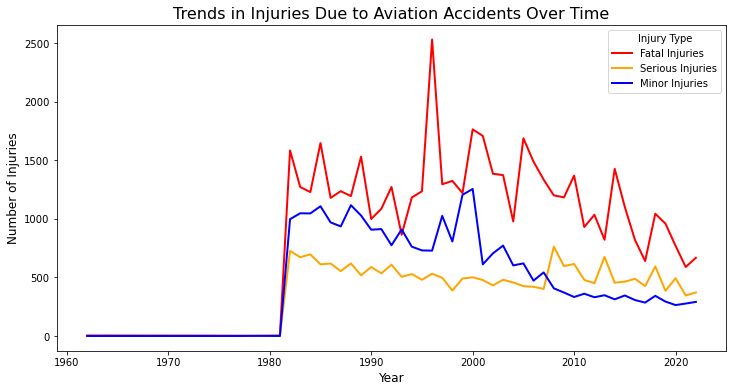
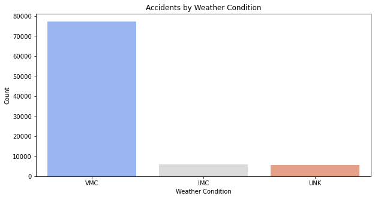
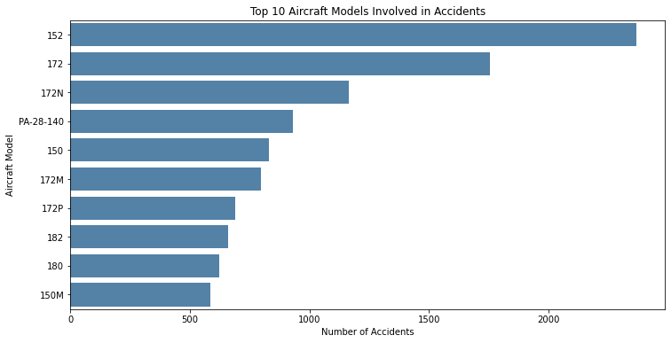
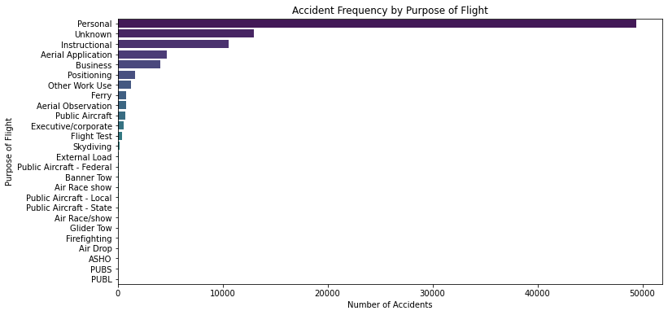
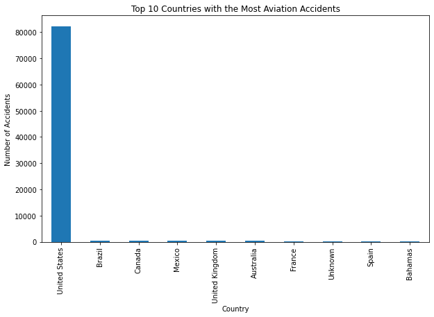

# Risk Assessment for Aircraft Business expansion
## Overview
Our company is expanding into new industries to diversify its portfolio. They are interested in purchasing and operating airplanes for commercial and private enterprises, but do not know anything about the potential risks of aircraft. My task is to determine which aircraft are the lowest risk for the company. This project will use data science techniques to analyze the NTSB aviation accident dataset up to Feb 2021 to identify the safest options for the company to start this new business endeavor

## Business Understanding
Specifically, the company is interested in purchasing and operating airplanes for commercial and private enterprises, but do not know anything about the potential risks of aircraft. For the company to make effective decision on the business, the following  business questions should be answered:
1. What are the trends in aviation accidents over time?
2. What are the trends in Injuries Due to Aviation Accidents Over Time?
3. Do weather conditions influence accidents?
4. Are there specific aircraft models that are involved in more accidents?
5. Is there a correlation between the number of engines and number of accidents?
6. Is there a relationship between the purpose of the plane and the number of accidents?
7. Which countries or locations experience the highest number of aviation accidents

## Data Understanding and Analysis
The dataset, sourced from the [Kaggle National Transportation Safety Board (NTSB)](https://www.kaggle.com/datasets/khsamaha/aviation-accident-database-synopses), contains 88,889 records of civil aviation accidents spanning from 1962 to 2023. It includes 31 attributes, covering accident details such as date, location, aircraft make/model, injury severity, weather conditions, and phase of flight. While rich in insights, the dataset has missing values in key fields like latitude/longitude, aircraft category, and injury counts, which may impact analysis. The data provides an opportunity to explore accident trends, risk factors, human and operational influences, and regulatory impacts, helping to enhance aviation safety and decision-making.
### Data analysis
Analysis are based on our business questions as shown below.

#### 1. Determining trends in aviation accidents over time
Visualization below shows the trends in aviation accidents over time.

We can observe that there has been an overall drop of aviation accidents from 1982 to the year 2023. In the year 1982 we had the highest record of aviation accidents and 2020 having the lowest as the current lowest aviation accident recorded. From the year 1963 to 1981 we had the lowest aviation accidents recorded.

### 2. Analyzing trends in Injuries Due to Aviation Accidents Over Time
Visualization below shows the trends in levels of injuries over time hence answering our business problem.

From the lineplot above we can observe that we have high records of fatal accidents followed by the minor injuries and finally serious injuries until the year 2008 where serious injuries are higher than minor injuries untill the year 2023.

Fatal, serious and minor injuries have been recorded to be reducing gradually over the year.

### 3. Determining if weather conditions influence accidents
The bar graph below shows how weather influence aviation accidents.

From the above visualization: It turns out that accidents are mainly experienced during visual meteorological conditions (VMC) compared to instrument meteorological conditions (IMC) which might seem counterintuitive as one might expect more accidents in poorer visibility conditions

### 4. Determining wheter there specific aircraft models that are involved in more accidents
From the bar graph below we can come to a conclusion in which aircrafts are prone to accidents.

The aircraft model 152 has the highest accident count, with just over 2000 accidents. This is significantly higher than any other model listed on the graph. Followed by model 172 with accidents over 1500 recorded. This shows that models with high accident records like 152, 172 and 172N are likely to be in an accidet compared to other models.

### 5. Analyzing the correlation between the number of engines and number of accidents
The scatterplot below shows the relationship between the number of engines and the number of accidents.
)
We can also observe that Correlation between Number of accidents and Number of engines is a weak negative correlation of -0.42925333836 hence does not influence the number of accidents.

### 6. Defining relationship between the purpose of the plane and the number of accidents
Below is a bar graph showing the trends between the purpose of the plane and the number of accidents.

We can observe that personal flights have the highest record of number of accidents of over 4000.

For the other purposes of flight each has a records of less than 2000 with flight test with the least.
### 7. Finding out Which countries or locations experience the highest number of aviation accidents
From visualization below we can find out which country has the highest record of accidents

As seen from the visualization above, the United states is the most dominant country in our dataset with over 90% of data.

## Conclusion
Our analysis of aviation accident data highlights key risk factors that must be addressed before starting the aviation business. While aviation safety has improved over the years, factors such as aircraft model choice, purpose of the aircraft maintenance practices, pilot training, and flight conditions play a critical role in accident prevention. By implementing data-driven safety measures, investing in well-maintained multi-engine aircraft, and adhering to strict operational standards, we can mitigate risks and enhance flight safety. These insights will guide strategic decisions to ensure a safe and sustainable aviation operatio
# Tableau Visualizations
The following link [Tableau Visualizations](https://public.tableau.com/views/phase1_project_17387741981440/RiskassessmentforAircraftbusinessexpansionDashboard?:language=en-US&:sid=&:display_count=n&:origin=viz_share_link) is a link to the dashbord that shows the visualizations that were visualized on Tableau workbooks and added to a dashboard.
